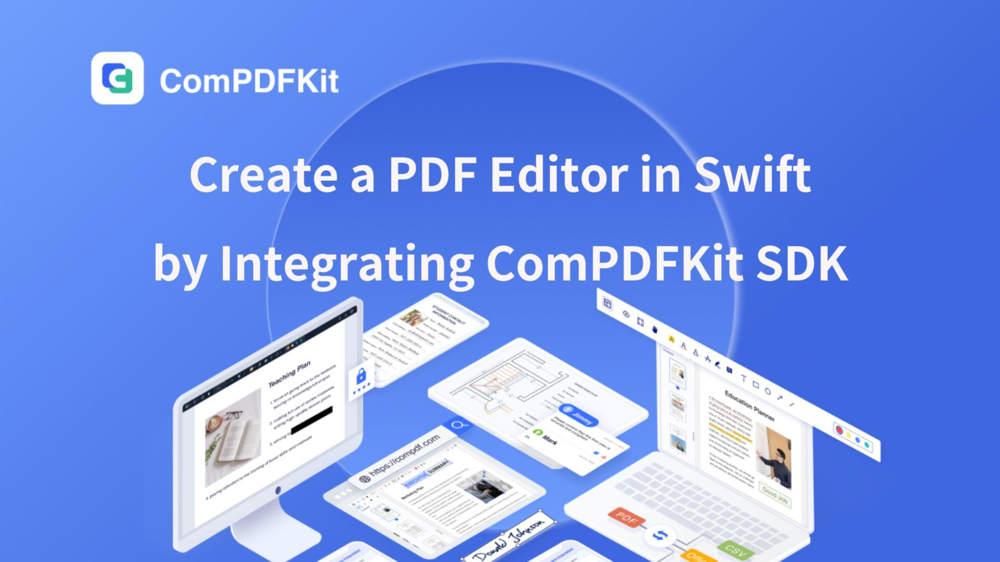

# Introduction

ComPDFKit PDF SDK for Swift is developed and maintained by [ComPDF](https://www.compdf.com/), enabling developers to quickly and seamlessly integrate advanced PDF functionalities—such as viewing, editing, annotating, and signing—into any iOS or macOS application.

More Information can be found at: https://www.compdf.com/guides/pdf-sdk/ios/overview


# Table of Contents
- [Related](#related)
- [Requirements](#requirements)
- [How to Make an iOS App in Swift with ComPDFKit](#how-to-make-an-ios-app-in-swift-with-compdfkit)
- [Supports](#support)
- [License](#license)
- [Note](#note)

# Related

- [ComPDFKit PDF SDK for iOS Documentation Guide](https://www.compdf.com/guides/pdf-sdk/ios/overview)

- [ComPDFKit PDF Library for Android](https://github.com/ComPDFKit/compdfkit-pdf-sdk-android)

- [How to Build a Swift PDF Editor and Reader to Edit PDF on iOS](https://www.compdf.com/blog/build-an-ios-pdf-viewer-or-editor-in-swift)

- [How to Build an iOS PDF Viewer or Editor in Objective-C](https://www.compdf.com/blog/build-an-ios-pdf-viewer-or-editor-in-objective-c)

- [Code Samples for iOS](https://www.compdf.com/guides/pdf-sdk/ios/examples)

- [ComPDF API Reference](https://api.compdf.com/api-reference/overview)

  

# Requirements

[ComPDFKit PDF SDK for iOS](https://www.compdf.com/guides/pdf-sdk/ios/overview) requires the latest stable version of Xcode available at the time the release was made. This is a hard requirement, as each version of Xcode is bundled with a specific version of the iOS Base SDK, which often defines how UIKit and various other frameworks behave. 

- iOS 10.0 or higher.
- Xcode 13.0 or newer for Objective-C or Swift.


# How to Make an iOS App in Swift with ComPDFKit

This section will help you to quickly get started with ComPDFKit PDF SDK to make an iOS/macOS app in Swift with step-by-step instructions, which include the following steps:

- Create a new iOS/macOS project in Swift.
- Integrate ComPDFKit into your apps.
- Apply the license key.
- Display a PDF document.

## Video Guide!

[](https://youtu.be/pA-Dsv-qe0c?si=jaij_XNujPdM02xF%0A)


## Create a New iOS Project in Swift

In this guide, we use Xcode 12.4 to create a new iOS project.

1. Fire up Xcode, choose **File** -> **New** -> **Project...**, and then select **iOS** -> **Single View Application**. Click **Next**.


2. Choose the options for your new project. Please make sure to choose Swift as the programming language. Then, click **Next**.


3. Place the project to the location as desired. Then, click **Create**.


## Integrate ComPDFKit into Your Apps

To add the dynamic xcframework ***"ComPDFKit.xcframework"*** into the ***"PDFViewer"*** project, please follow the steps below:

1. Right-click the ***"PDFViewer"*** project, select **Add Files to "PDFViewer"...**.

   

2. Find and choose ***"ComPDFKit.xcframework"*** in the download package, and then click **Add**.

   **Note:** *Make sure to check the **Copy items if needed** option.*

   

3. Then, the ***"PDFViewer"*** project will look like the following picture.

   

4. Add the dynamic xcframework ***"ComPDFKit.xcframework"*** to the Xcode's **Embedded Binaries**. Left-click the project, find **Embedded Binaries** in the **General** tab, and choose **Embed & Sign**.

   

5. For earlier versions of Xcode (like Xcode 13), the Bitcode option might be turned on by default, which requires it to be turned off to run. The precise steps to do this are illustrated as shown in the picture below. 

   


## Apply the License Key

Go to [ComPDF Pricing](https://www.compdf.com/pricing) to get a free license to test this project.

1. Import the header file ***"ComPDFKit"*** to `AppDelegate.swift`.

2. License initialize:

   **Online license:** 

   Follow the code below and call the method `CPDFKit.verify(withOnlineLicense: "YOUR_LICENSE_KEY_GOES_HERE") { code, message in}`   in  ` func application(_ application: UIApplication, didFinishLaunchingWithOptions launchOptions: [UIApplication.LaunchOptionsKey: Any]?) -> Bool`. You need to replace the  **LICENSE_KEY** with the license you obtained.

      ```swift
     func application(_ application: UIApplication, didFinishLaunchingWithOptions launchOptions: [UIApplication.LaunchOptionsKey: Any]?) -> Bool {
     // Set your online license key here. ComPDFKit is commercial software.
     // Each ComPDFKit license is bound to a specific app bundle id.
     // com.compdfkit.pdfviewe
       
       CPDFKit.verify(withOnlineLicense: "YOUR_LICENSE_KEY_GOES_HERE") { code, message in
       }
   }
      ```

   **Offline license:**

    Follow the code below and call the method `CPDFKit.verifyWithKey:"LICENSE_SECRET"` in `func application(_ application: UIApplication, didFinishLaunchingWithOptions launchOptions: [UIApplication.LaunchOptionsKey: Any]?) -> Bool `. You need to replace the  **LICENSE_KEY**  with the license you obtained.

   ```swift
     func application(_ application: UIApplication, didFinishLaunchingWithOptions launchOptions: [UIApplication.LaunchOptionsKey: Any]?) -> Bool {
     // Set your license key here. ComPDFKit is commercial software.
     // Each ComPDFKit license is bound to a specific app bundle id.
     // com.compdfkit.pdfviewer
       
       CPDFKit.verify(withKey: "YOUR_LICENSE_KEY_GOES_HERE")
       return true
   }
   ```


3. Compile and run the project. If the console outputs "version information", it means that the license has been set successfully. Otherwise, please check "Troubleshooting" or check error logs in the console to quickly identify and solve the issue. 


## Display a PDF Document

So far, we have added ***"ComPDFKit.xcframework"*** to the ***"PDFViewer"*** project and finished the initialization of the ComPDFKit PDF SDK. Now, let’s start building a simple PDF viewer with just a few lines of code.

1. Prepare a test PDF file, and drag and drop it into the newly created **PDFView** project. In this way, you can load and preview the local PDF document using `NSBundle`. The following image shows an example of importing a PDF document named "Online5" into the project.

   

2. Import `ComPDFKit`  at the top of your `UIViewController.swift` subclass implementation:

   ```swift
   import ComPDFKit
   ```

3. Create a `CPDFDocument` object through **NSURL**, and create a `CPDFView` to display it. The following code shows how to load PDF data using a local PDF path and display it by `CPDFView`.

   ```swift
   guard let filePath = Bundle.main.path(forResource: "Online5", ofType: "pdf") else { return  }
   let url = URL(fileURLWithPath: filePath)
   let document = CPDFDocument(url: url)
   
   let rect = self.view.bounds
   let pdfView = CPDFView(frame: self.view.bounds)
   pdfView.autoresizingMask = [.flexibleWidth, .flexibleHeight]
   pdfView.document = document
   ```

4. Add the created `CPDFView` to the view of the current controller. The sample code is shown below.

   ```swift
   self.view.addSubview(pdfView)
   ```

5. The code shown here is a collection of the steps mentioned above:

   ```swift
   override func viewWillAppear(_ animated: Bool) {
        super.viewWillAppear(animated)
           
        guard let filePath = Bundle.main.path(forResource: "Online5", ofType: "pdf") else { return  }
        let url = URL(fileURLWithPath: filePath)
        let document = CPDFDocument(url: url)
   
        let rect = self.view.bounds
        let pdfView = CPDFView(frame: self.view.bounds)
        pdfView.autoresizingMask = [.flexibleWidth, .flexibleHeight]
        pdfView.document = document
        self.view.addSubview(pdfView)
   }
   ```

6. Connect your device or simulator, and use the shortcut **Command_R** to run the App. The PDF file will be opened and displayed.

   


## Troubleshooting

1. Bitcode

   Even when all configurations are correct, there may still be compilation errors. First, check if the Bitcode is disabled. In earlier versions of Xcode (such as Xcode 13), the Bitcode option may be enabled by default. It needs to be set to **No** in order to run the app.

2. License

   If a License setting error occurs, ensure that the Identity ([Bundle ID](https://www.compdf.com/faq/how-to-find-the-bundle-id)) setting in **General** matches the Bundle ID you provided when contacting us for the license. If an expired License message appears, please contact the [ComPDFKit team](https://www.compdf.com/contact-sales) to obtain the latest License and Key.


3. Cannot Run on i386 Architecture Simulator

   The version of Xcode 12.5 or newer, doesn't support i386 simulators. Apple dropped the i386 after switching to ARM processors and no longer maintains i386 architecture simulators. Please use ARM simulators or x86_64 architecture simulators to test and develop your program.

   So you need to search for **Excluded Architectures** in **Build Settings** in **TARGETS**, and then double-click it. A pop-up window will be popped up, click the plus sign (as shown below) to add **i386**.

   

4. No PDF Displayed

   Check if the special encoding is required in the path we passed in, or if the local path we passed in exists.


5. Other Problems

   If you meet some other problems when integrating our ComPDFKit PDF SDK for iOS, feel free to contact [ComPDFKit's support team](https://www.compdf.com/support).


# Support

ComPDF offers professional technical support and 5*24 responsive service.

- For detailed information, please visit our [Guides](https://www.compdf.com/guides/pdf-sdk/ios/overview) page.

- Stay updated with the latest improvements through our [Changelog](https://www.compdf.com/pdf-sdk/changelog-ios).

- For technical assistance, please reach out to our [Technical Support](https://www.compdf.com/support).

- To get more details and an accurate quote, please contact our [Sales Team](https://www.compdf.com/contact-sales) or [Send an Email](mailto:support@compdf.com) to us.


# License

ComPDF offers developers a [30-day free trial](https://www.compdf.com/pricing) license for free testing your iOS projects. Additionally, you'll have access to a fully-featured product with no limitations on file or user count.


# Note
We are glad to announce that you can [register a ComPDF API account](https://api.compdf.com/signup) for a free trial to process 1000 documents per month for free.

