# ComPDF SDK for iOS (Swift PDF Library)

As part of the KDAN ecosystem, [ComPDF SDK for iOS](https://www.compdf.com/ios?utm_source=github&utm_medium=compdfkit-pdf-sdk-ios-swift&utm_campaign=compdfkit_pdf_sdk_ios_swift_repo&ref_platform_id=github_compdfkit) is developed and maintained by [ComPDF](https://www.compdf.com/?utm_source=github&utm_medium=compdfkit-pdf-sdk-ios-swift&utm_campaign=compdfkit_pdf_sdk_ios_swift_repo&ref_platform_id=github_compdfkit), enabling developers to quickly integrate advanced PDF viewing, editing, annotation, form, and signing capabilities into iPhone and iPad apps.

The ComPDF iOS PDF Library provides a native Swift API and polished UI components so teams can ship PDF features faster without rebuilding document tools from scratch.

> If you find ComPDF SDK useful, please consider giving us a ⭐ **Star** on GitHub — it helps us grow and improve! Got questions or ideas? Join the conversation in our [Discussions](https://github.com/ComPDFKit/compdfkit-pdf-sdk-ios-swift/discussions).


**Why ComPDF SDK for iOS?**

* **Easy to Integrate:** Integrate PDF functionalities easily with our powerful SDK and clear documentation and guides with few lines of code.

* **Fully Customizable UI:** Design a unique interface for your products with fully customizable UI source code by a high-performing SDK.

* **[Comprehensive PDF Features:](https://www.compdf.com/pdf-sdk/features-list?utm_source=github&utm_medium=compdfkit-pdf-sdk-ios-swift&utm_campaign=compdfkit_pdf_sdk_ios_swift_repo&ref_platform_id=github_compdfkit)** Supports generation, viewing, annotation, page editing, content editing, conversion, OCR, redaction, signing, forms, parsing, measurement, compression, comparison, color separation, batch processing, and more.

* **Faster Time-to-Market:** Comprehensive SDK libraries save your time and expenses and roll out your applications and projects.

* **High-quality Service:** We provide 24/7 professional one-to-one technical support, including onsite service and remote assistance via phone and email.


## Table of Contents

- [Supported Features](#supported-features)
- [Preview](#preview)
- [Requirements](#requirements)
- [How to Make an iOS App in Swift](#how-to-make-an-ios-app-in-swift)
- [Changelog](#changelog)
- [Free Trial & License](#free-trial-and-license)
- [Support](#support)
- [Changelog](#changelog)
- [Related](#related)

## Supported Features

**Viewer**: Fast and smooth PDF rendering and viewing

* Display Modes - single/double page, vertical & horizontal scrolling, cover mode, crop mode
* Text Search & Selection
* PDF Navigation - outlines, bookmarks

**Annotations**:

- Notes - add longer comments with adjustable icon shape and color
* Ink - freehand drawing with customizable color, opacity, line thickness
* Text - add, move, resize text directly on page
* Inspector - adjust annotation looks (line styles, borders, colors, opacity, font)
* Comment on Annotations and Update Status
* Import & Export & Flatten Annotations (XFDF, FDF, JSON)
* Highlight, Underline, Strikeout, Squiggly
* Shapes - Rectangle, Oval, Line, Arrow, Polygon, Polyline, Cloud
* Stamps, Sound, Movie, File Attachment, Link, Distance, Perimeter, Area

**Document Editor**: 

- Page manipulation - insert, delete, rotate, reorder, extract, crop
* Split PDF, Merge PDF

**Content Editor**: Edit PDF text and images directly like in Word

**Watermark:** 

- Add Text or Image Watermarks

- Delete Watermarks

- Customize Watermarks

**OCR:**

- AI OCR

- Recognize Tables, Graphics, Images

- Support recognition in 80+ Languages

**Signatures**: 

- Electronic Signatures - draw, type, image signatures
* Digital Signatures - certificate-based signature validation

**Forms**:

- Process fillable and static PDF forms
* Form filling, form creation, form flattening

**Security**: 

- Encryption - set open password, permission password
* Restrict printing, copying, editing

**Redaction**: Permanently remove sensitive content from PDFs

**Measurement**: Distance, area, perimeter measurement tools

**Compress**: Optimize and reduce PDF file size

**Compare Documents**: Side-by-side document comparison to highlight differences

**PDF/A, PDF/X, PDF/E, PDF/UA**: Standards compliance for archiving, printing, engineering, and accessibility

**Convert Files**: 

- Convert PDF to Word, Excel, PPT, HTML, CSV, images (PNG,JPEG, JPEG, JPEG2000, BMP, TIFF, TGA, GIF), RTF, TXT, JSON, XML, markdown, searchable PDF, searchable OFD.

- Convert images (PNG,JPEG, JPEG, JPEG2000, BMP, TIFF, TGA, GIF) to Word, Excel, PPT, HTML, CSV, RTF, TXT, JSON, XML.

- Convert Word, Excel, PPT, HTML, CSV, PNG, RTF, TXT to PDF

**UI Customization**:

* Toolbar Customization

* UI Personalization

* Ready-Made UI Options

* Out-of-the-box Source Code

## Preview

ComPDF SDK for iOS delivers a smooth, feature-rich PDF experience on iOS mobile devices.


## Requirements

[ComPDF SDK for iOS](https://www.compdf.com/guides/pdf-sdk/ios/overview?utm_source=github&utm_medium=compdfkit-pdf-sdk-ios-swift&utm_campaign=compdfkit_pdf_sdk_ios_swift_repo&ref_platform_id=github_compdfkit) requires the latest stable version of Xcode available at the time the release was made. This is a hard requirement, as each version of Xcode is bundled with a specific version of the iOS Base SDK, which often defines how UIKit and various other frameworks behave.

* iOS 10.0 or higher.
* Xcode 13.0 or newer for Objective-C or Swift.


## How to Make an iOS App in Swift

This section will help you to quickly get started with ComPDF SDK to make an iOS/macOS app in Swift with step-by-step instructions, which include the following steps:

- Create a new iOS/macOS project in Swift.
- Integrate ComPDF into your apps.
- Apply the license key.
- Display a PDF document.

### Video Guide

[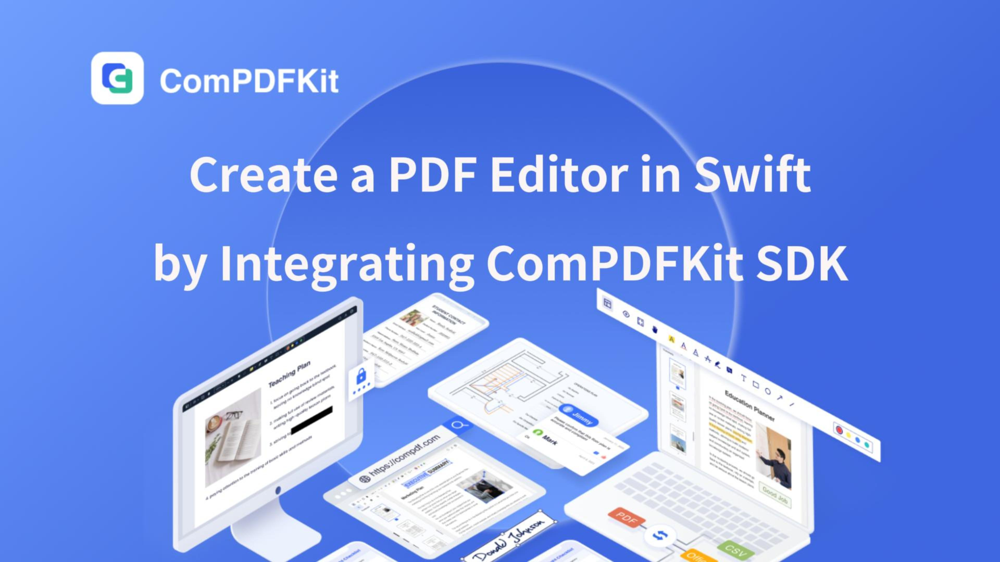](https://youtu.be/pA-Dsv-qe0c?si=jaij_XNujPdM02xF%0A)

### Create a New Project

In this guide, we use Xcode 12.4 to create a new iOS project.

1. Fire up Xcode, choose **File** -> **New** -> **Project...**, and then select **iOS** -> **Single View Application**. Click **Next**.

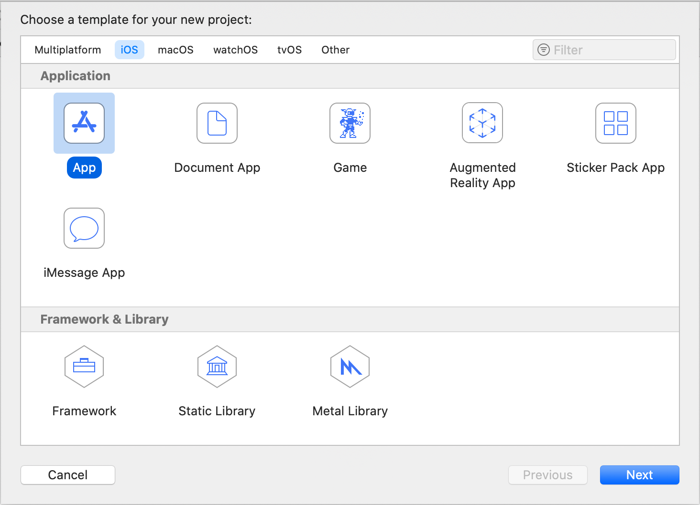

2. Choose the options for your new project. Please make sure to choose Swift as the programming language. Then, click **Next**.

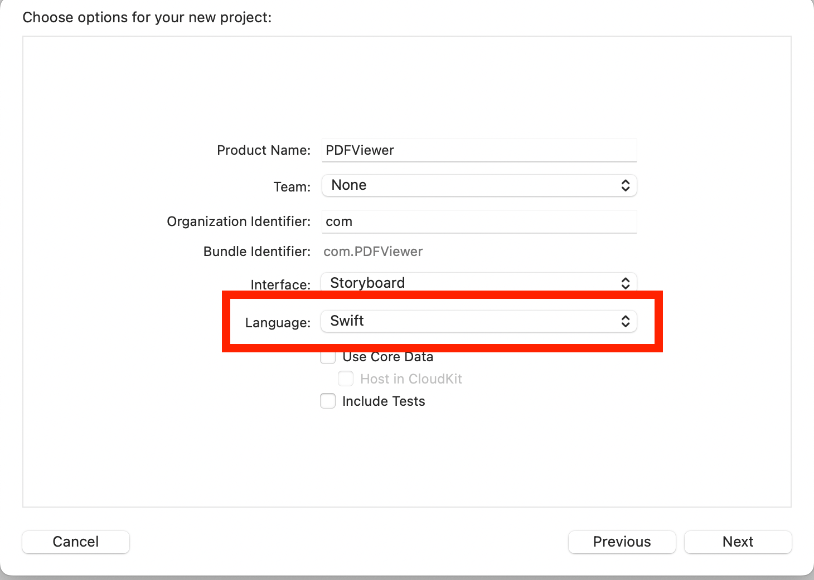

3. Place the project to the location as desired. Then, click **Create**.

### Integrate ComPDF into Your Apps

To add the dynamic xcframework ***"ComPDF.xcframework"*** into the ***"PDFViewer"*** project, please follow the steps below:

1. Right-click the ***"PDFViewer"*** project, select **Add Files to "PDFViewer"...**.
   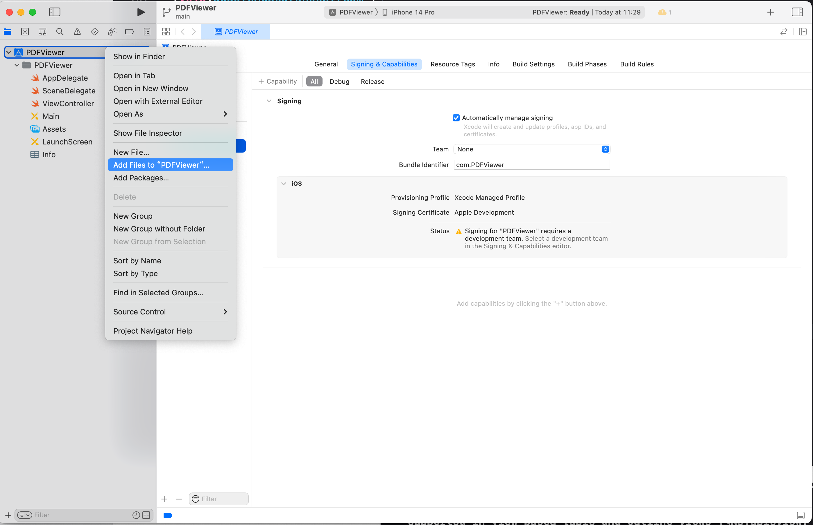

2. Find and choose ***"ComPDF.xcframework"*** in the download package, and then click **Add**.
   **Note:** *Make sure to check the **Copy items if needed** option.*
   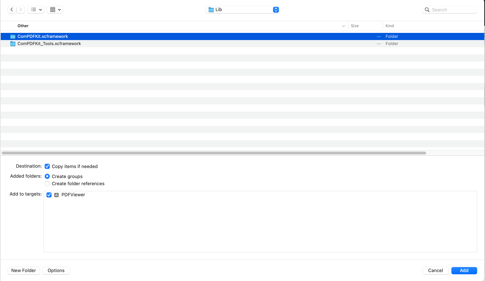

3. Then, the ***"PDFViewer"*** project will look like the following picture.
   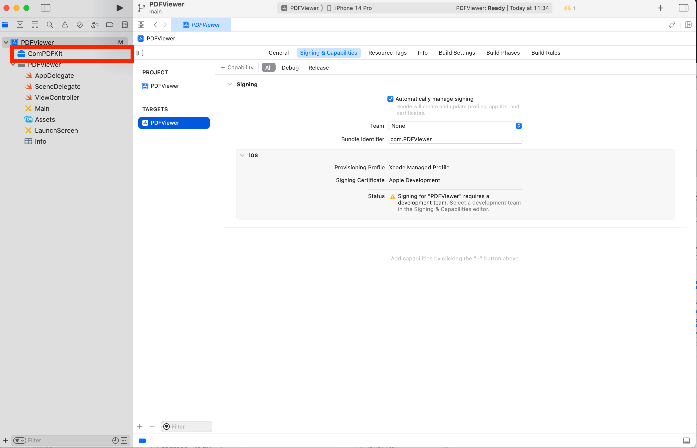

4. Add the dynamic xcframework ***"ComPDF.xcframework"*** to the Xcode's **Embedded Binaries**. Left-click the project, find **Embedded Binaries** in the **General** tab, and choose **Embed & Sign**.
   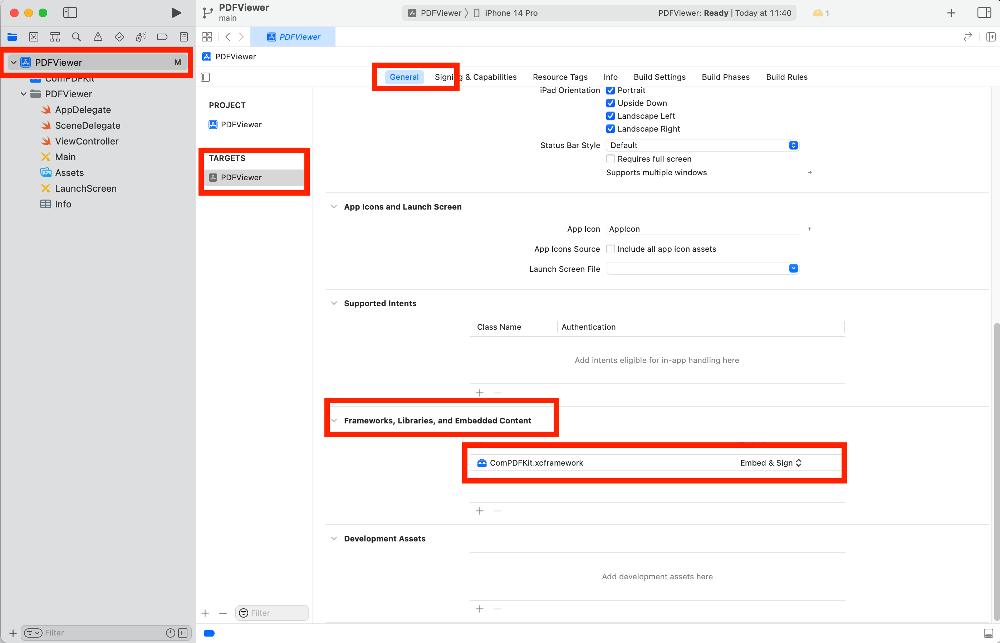

5. For earlier versions of Xcode (like Xcode 13), the Bitcode option might be turned on by default, which requires it to be turned off to run. The precise steps to do this are illustrated as shown in the picture below. 
   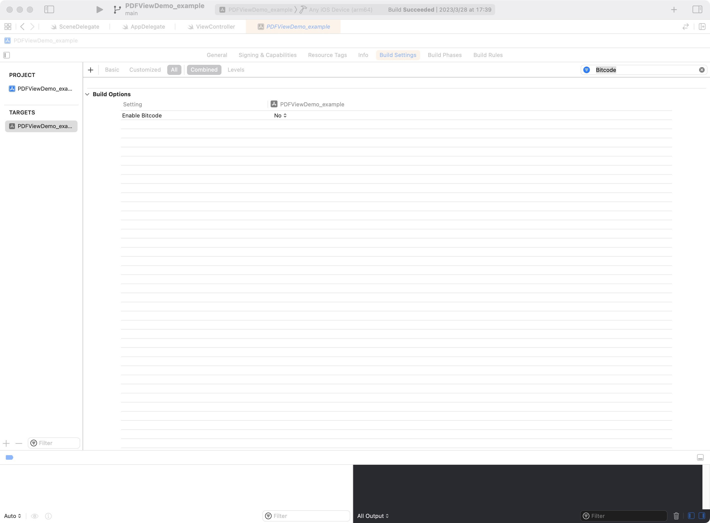

### Apply the License Key

Go to [ComPDF Pricing](https://www.compdf.com/pricing?utm_source=github&utm_medium=compdfkit-pdf-sdk-ios-swift&utm_campaign=compdfkit_pdf_sdk_ios_swift_repo&ref_platform_id=github_compdfkit) to get a free license to test this project.

1. Import the header file ***"ComPDF"*** to `AppDelegate.swift`.

2. License initialize:
   **Online license:** 
   Follow the code below and call the method `CPDFKit.verify(withOnlineLicense: "YOUR_LICENSE_KEY_GOES_HERE") { code, message in}`   in  ` func application(_ application: UIApplication, didFinishLaunchingWithOptions launchOptions: [UIApplication.LaunchOptionsKey: Any]?) -> Bool`. You need to replace the  **LICENSE_KEY** with the license you obtained.
   
   ```swift
     func application(_ application: UIApplication, didFinishLaunchingWithOptions launchOptions: [UIApplication.LaunchOptionsKey: Any]?) -> Bool {
     // Set your online license key here. ComPDFKit is commercial software.
     // Each ComPDFKit license is bound to a specific app bundle id.
     // com.compdfkit.pdfviewe
   
    CPDFKit.verify(withOnlineLicense: "YOUR_LICENSE_KEY_GOES_HERE") { code, message in
    }
   }
   ```
   
   **Offline license:**
    Follow the code below and call the method `CPDFKit.verifyWithKey:"LICENSE_SECRET"` in `func application(_ application: UIApplication, didFinishLaunchingWithOptions launchOptions: [UIApplication.LaunchOptionsKey: Any]?) -> Bool `. You need to replace the  **LICENSE_KEY**  with the license you obtained.
   
   ```swift
     func application(_ application: UIApplication, didFinishLaunchingWithOptions launchOptions: [UIApplication.LaunchOptionsKey: Any]?) -> Bool {
     // Set your license key here. ComPDFKit is commercial software.
     // Each ComPDFKit license is bound to a specific app bundle id.
     // com.compdfkit.pdfviewer
   
       CPDFKit.verify(withKey: "YOUR_LICENSE_KEY_GOES_HERE")
       return true
   }
   ```

3. Compile and run the project. If the console outputs "version information", it means that the license has been set successfully. Otherwise, please check "Troubleshooting" or check error logs in the console to quickly identify and solve the issue. 

### Display a PDF Document

So far, we have added ***"ComPDF.xcframework"*** to the ***"PDFViewer"*** project and finished the initialization of the ComPDF SDK. Now, let’s start building a simple PDF viewer with just a few lines of code.

1. Prepare a test PDF file, and drag and drop it into the newly created **PDFView** project. In this way, you can load and preview the local PDF document using `NSBundle`. The following image shows an example of importing a PDF document named "Online5" into the project.
   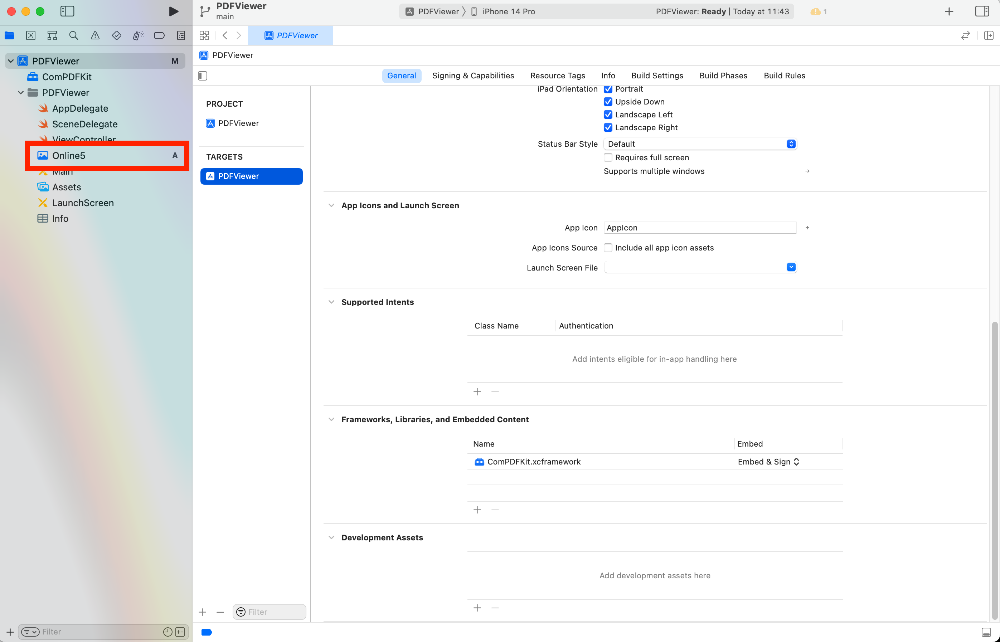

2. Import `ComPDFKit`  at the top of your `UIViewController.swift` subclass implementation:
   
   ```swift
   import ComPDFKit
   ```

3. Create a `CPDFDocument` object through **NSURL**, and create a `CPDFView` to display it. The following code shows how to load PDF data using a local PDF path and display it by `CPDFView`.
   
   ```swift
   guard let filePath = Bundle.main.path(forResource: "Online5", ofType: "pdf") else { return  }
   let url = URL(fileURLWithPath: filePath)
   let document = CPDFDocument(url: url)
   
   let rect = self.view.bounds
   let pdfView = CPDFView(frame: self.view.bounds)
   pdfView.autoresizingMask = [.flexibleWidth, .flexibleHeight]
   pdfView.document = document
   ```

4. Add the created `CPDFView` to the view of the current controller. The sample code is shown below.
   
   ```swift
   self.view.addSubview(pdfView)
   ```

5. The code shown here is a collection of the steps mentioned above:
   
   ```swift
   override func viewWillAppear(_ animated: Bool) {
        super.viewWillAppear(animated)
   
        guard let filePath = Bundle.main.path(forResource: "Online5", ofType: "pdf") else { return  }
        let url = URL(fileURLWithPath: filePath)
        let document = CPDFDocument(url: url)
   
        let rect = self.view.bounds
        let pdfView = CPDFView(frame: self.view.bounds)
        pdfView.autoresizingMask = [.flexibleWidth, .flexibleHeight]
        pdfView.document = document
        self.view.addSubview(pdfView)
   }
   ```

6. Connect your device or simulator, and use the shortcut **Command_R** to run the App. The PDF file will be opened and displayed.
   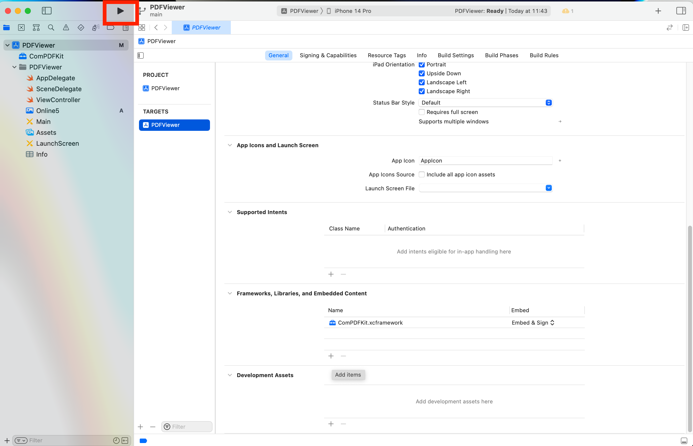

### Troubleshooting

1. Bitcode
   Even when all configurations are correct, there may still be compilation errors. First, check if the Bitcode is disabled. In earlier versions of Xcode (such as Xcode 13), the Bitcode option may be enabled by default. It needs to be set to **No** in order to run the app.

2. License
   If a License setting error occurs, ensure that the Identity ([Bundle ID](https://www.compdf.com/faq/how-to-find-the-bundle-id?utm_source=github&utm_medium=compdfkit-pdf-sdk-ios-swift&utm_campaign=compdfkit_pdf_sdk_ios_swift_repo&ref_platform_id=github_compdfkit)) setting in **General** matches the Bundle ID you provided when contacting us for the license. If an expired License message appears, please contact the [ComPDF team](https://www.compdf.com/contact-sales?utm_source=github&utm_medium=compdfkit-pdf-sdk-ios-swift&utm_campaign=compdfkit_pdf_sdk_ios_swift_repo&ref_platform_id=github_compdfkit) to obtain the latest License and Key.

3. Cannot Run on i386 Architecture Simulator
   The version of Xcode 12.5 or newer, doesn't support i386 simulators. Apple dropped the i386 after switching to ARM processors and no longer maintains i386 architecture simulators. Please use ARM simulators or x86_64 architecture simulators to test and develop your program.
   So you need to search for **Excluded Architectures** in **Build Settings** in **TARGETS**, and then double-click it. A pop-up window will be popped up, click the plus sign (as shown below) to add **i386**.
   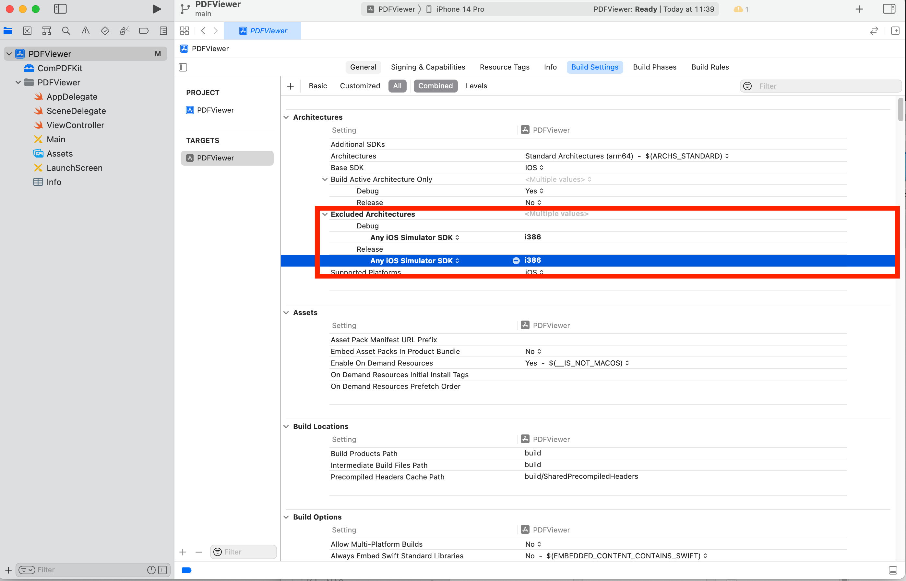

4. No PDF Displayed
   Check if the special encoding is required in the path we passed in, or if the local path we passed in exists.

5. Other Problems
   If you meet some other problems when integrating our ComPDF SDK for iOS, feel free to contact [ComPDF's support team](https://www.compdf.com/support?utm_source=github&utm_medium=compdfkit-pdf-sdk-ios-swift&utm_campaign=compdfkit_pdf_sdk_ios_swift_repo&ref_platform_id=github_compdfkit).


## Free Trial and License

[ComPDF SDK for iOS](https://www.compdf.com/?utm_source=github&utm_medium=compdfkit-pdf-sdk-ios-swift&utm_campaign=compdfkit_pdf_sdk_ios_swift_repo&ref_platform_id=github_compdfkit) offers a **30-day free trial** so you can evaluate core PDF capabilities in your own application.

To get started:

1. Apply for a [free trial](https://www.compdf.com/pricing?utm_source=github&utm_medium=compdfkit-pdf-sdk-ios-swift&utm_campaign=compdfkit_pdf_sdk_ios_swift_repo&ref_platform_id=github_compdfkit)
2. Review supported trial features and licensing details
3. Follow the integration and license steps above to activate the SDK in your project

For custom deployments, advanced features, or volume licensing, please [contact our sales team](https://www.compdf.com/contact-sales?utm_source=github&utm_medium=compdfkit-pdf-sdk-ios-swift&utm_campaign=compdfkit_pdf_sdk_ios_swift_repo&ref_platform_id=github_compdfkit)

## Support

[ComPDF](https://www.compdf.com/?utm_source=github&utm_medium=compdfkit-pdf-sdk-ios-swift&utm_campaign=compdfkit_pdf_sdk_ios_swift_repo&ref_platform_id=github_compdfkit) has a professional R&D team that produces comprehensive technical documentation and guides to help developers. Also, you can get an immediate response when reporting your problems to our support team.

* For detailed information, please visit our [Guides](https://www.compdf.com/guides/pdf-sdk/ios/overview?utm_source=github&utm_medium=compdfkit-pdf-sdk-ios-swift&utm_campaign=compdfkit_pdf_sdk_ios_swift_repo&ref_platform_id=github_compdfkit) page.
* For technical assistance, please reach out to our [Technical Support](https://www.compdf.com/support?utm_source=github&utm_medium=compdfkit-pdf-sdk-ios-swift&utm_campaign=compdfkit_pdf_sdk_ios_swift_repo&ref_platform_id=github_compdfkit).
* To get more details and an accurate quote, please contact our [Sales Team](https://www.compdf.com/contact-sales?utm_source=github&utm_medium=compdfkit-pdf-sdk-ios-swift&utm_campaign=compdfkit_pdf_sdk_ios_swift_repo&ref_platform_id=github_compdfkit) or [send an email](mailto:support@compdf.com).

## Changelog

Keep up with the latest updates, improvements, and bug fixes for ComPDF SDK for iOS: [View iOS Changelog](https://www.compdf.com/pdf-sdk/changelog-ios?utm_source=github&utm_medium=compdfkit-pdf-sdk-ios-swift&utm_campaign=compdfkit_pdf_sdk_ios_swift_repo&ref_platform_id=github_compdfkit)

## Related

* More Guides:
  
  - [API Reference for ComPDF (iOS)](https://developers.compdf.com/guides/pdf-sdk/ios/api-reference/index)
  
  - [ComPDF SDK for iOS Documentation Guide](https://www.compdf.com/guides/pdf-sdk/ios/overview?utm_source=github&utm_medium=compdfkit-pdf-sdk-ios-swift&utm_campaign=compdfkit_pdf_sdk_ios_swift_repo&ref_platform_id=github_compdfkit)
  
  - [How to Build an iOS PDF Viewer or Editor in Swift](https://www.compdf.com/blog/build-an-ios-pdf-viewer-or-editor-in-swift?utm_source=github&utm_medium=compdfkit-pdf-sdk-ios-swift&utm_campaign=compdfkit_pdf_sdk_ios_swift_repo&ref_platform_id=github_compdfkit)
  
  - [Code Samples for iOS](https://www.compdf.com/guides/pdf-sdk/ios/examples?utm_source=github&utm_medium=compdfkit-pdf-sdk-ios-swift&utm_campaign=compdfkit_pdf_sdk_ios_swift_repo&ref_platform_id=github_compdfkit)
  
  - [ComPDF API Reference](https://api.compdf.com/api-reference/overview?utm_source=github&utm_medium=compdfkit-pdf-sdk-ios-swift&utm_campaign=compdfkit_pdf_sdk_ios_swift_repo&ref_platform_id=github_compdfkit)
- More Platforms and Frameworks: [ComPDF SDK](https://www.compdf.com/?utm_source=github&utm_medium=compdfkit-pdf-sdk-ios-swift&utm_campaign=compdfkit_pdf_sdk_ios_swift_repo&ref_platform_id=github_compdfkit) seamlessly operates on [Web](https://www.compdf.com/web?utm_source=github&utm_medium=compdfkit-pdf-sdk-ios-swift&utm_campaign=compdfkit_pdf_sdk_ios_swift_repo&ref_platform_id=github_compdfkit), [Windows](https://www.compdf.com/windows?utm_source=github&utm_medium=compdfkit-pdf-sdk-ios-swift&utm_campaign=compdfkit_pdf_sdk_ios_swift_repo&ref_platform_id=github_compdfkit), [Android](https://www.compdf.com/android?utm_source=github&utm_medium=compdfkit-pdf-sdk-ios-swift&utm_campaign=compdfkit_pdf_sdk_ios_swift_repo&ref_platform_id=github_compdfkit), [iOS](https://www.compdf.com/ios?utm_source=github&utm_medium=compdfkit-pdf-sdk-ios-swift&utm_campaign=compdfkit_pdf_sdk_ios_swift_repo&ref_platform_id=github_compdfkit), [Mac](https://www.compdf.com/contact-sales?utm_source=github&utm_medium=compdfkit-pdf-sdk-ios-swift&utm_campaign=compdfkit_pdf_sdk_ios_swift_repo&ref_platform_id=github_compdfkit), and [Server](https://www.compdf.com/server?utm_source=github&utm_medium=compdfkit-pdf-sdk-ios-swift&utm_campaign=compdfkit_pdf_sdk_ios_swift_repo&ref_platform_id=github_compdfkit), with support for cross-platform frameworks such as [React Native](https://www.compdf.com/react-native?utm_source=github&utm_medium=compdfkit-pdf-sdk-ios-swift&utm_campaign=compdfkit_pdf_sdk_ios_swift_repo&ref_platform_id=github_compdfkit), [Flutter](https://www.compdf.com/flutter?utm_source=github&utm_medium=compdfkit-pdf-sdk-ios-swift&utm_campaign=compdfkit_pdf_sdk_ios_swift_repo&ref_platform_id=github_compdfkit), etc.

- ComPDF Cloud: We also provide Open API for developers. You can [register a free API account](https://api.compdf.com/signup?utm_source=github&utm_medium=compdfkit-pdf-sdk-ios-swift&utm_campaign=compdfkit_pdf_sdk_ios_swift_repo&ref_platform_id=github_compdfkit) to get up to 200+ API calls monthly for free.
