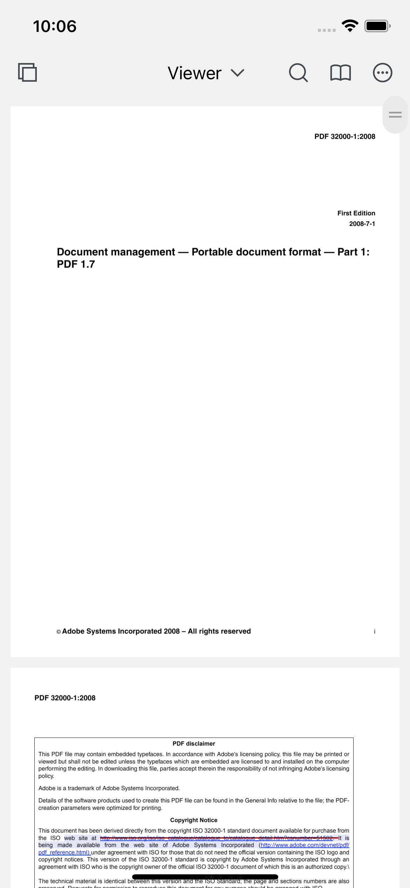

# Introduction

[ComPDFKit PDF SDK](https://www.compdf.com/) offers powerful Swift APIs and robust PDF libraries for developers who need to develop applications on iOS and macOS for quickly viewing, annotating, editing, and creating PDFs. It is feature-rich and battle-tested, making PDF files process and manipulation easier and faster for iOS and macOS devices.

[ComPDFKit API](https://api.compdf.com/api/pricing) allows you to get 1000 files processing monthly now! Just [sign up](https://api.compdf.com/signup) for a free trial and enjoy comprehensive PDF functions.

# Related

- [ComPDFKit PDF Library for iOS](https://github.com/ComPDFKit/compdfkit-pdf-sdk-ios)

- [ComPDFKit PDF Library for Android](https://github.com/ComPDFKit/PDF-SDK-Android)

- ComPDFKit PDF SDK - [Flutter Library](https://pub.dev/packages/compdfkit_flutter)

- ComPDFKit PDF SDK - [React Native Library](https://www.compdf.com/react-native)

- [How to Build an iOS PDF Viewer or Editor in Objective-C](https://www.compdf.com/blog/build-an-ios-pdf-viewer-or-editor-in-objective-c)

- [How to Build an iOS PDF Viewer or Editor in Swift](https://www.compdf.com/blog/build-an-ios-pdf-viewer-or-editor-in-swift)

  

# Get Started

It is easy to embed ComPDFKit in your iOS/macOS app with a few lines of Swift code. Take just a few minutes and get started. 

The following sections introduce the requirements of building an iOS/macOS app , how to run a demo, and how to make it in Swift with [ComPDFKit iOS PDF SDK.](https://www.compdf.com/ios) 


## Requirements

[ComPDFKit PDF SDK for iOS](https://www.compdf.com/guides/pdf-sdk/ios/overview) requires the latest stable version of Xcode available at the time the release was made. This is a hard requirement, as each version of Xcode is bundled with a specific version of the iOS Base SDK, which often defines how UIKit and various other frameworks behave. 

- iOS 10.0 or higher.
- Xcode 13.0 or newer for Objective-C or Swift.


## How to Run a Demo

ComPDFKit PDF SDK for iOS provides multiple demos in Swift for developers to learn how to call the SDK on iOS or macOS. You can find them in the ***"Examples"*** folder.

In this guide, we take ***"PDFViewer"*** as an example to show how to run it in Xcode (The demo in Swift uses the ***"xcworkspace"*** method, so you can directly open ***"PDFViewer.xcworkspace"***.

1. Copy the applied ***"license_key_ios.xml"*** file to ***"Examples"*** folder to replace (There is already a method to parse the xml file in demo, please do not modify the storage location and file name).

2. Find ***"PDFViewer.xcworkspace"*** in the ***"Examples"*** folder and double-click to open it, find the schemes of ***"PDFViewer"*** in Xcode, and select the corresponding simulator (ComPDFKit does not support the simulator to run M1 chip, but we have made it compatible in `Excluded Architectures`, you can see the processing method in **"Troubleshooting"**.


Click **Product -> Run** to run the demo on an iOS/macOS device. In this guide, we use an iPhone 14 device as an example. After building the demo successfully, the ***"PDF32000_2008.pdf"*** file will be opened and displayed.



**Note:** *This is a demo project, presenting completed [ComPDFKit PDF SDK](https://www.compdf.com/pdf-sdk) functions. The functions might be different based on the license you have purchased. Please check that the functions you choose work fine in this demo project.*


## How to Make an iOS App in Swift with ComPDFKit

This section will help you to quickly get started with ComPDFKit PDF SDK to make an iOS/macOS app in Swift with step-by-step instructions, which include the following steps:

- Create a new iOS/macOS project in Swift.
- Integrate ComPDFKit into your apps.
- Apply the license key.
- Display a PDF document.

### Create a New iOS Project in Swift

In this guide, we use Xcode 12.4 to create a new iOS project.

1. Fire up Xcode, choose **File** -> **New** -> **Project...**, and then select **iOS** -> **Single View Application**. Click **Next**.


2. Choose the options for your new project. Please make sure to choose Swift as the programming language. Then, click **Next**.


3. Place the project to the location as desired. Then, click **Create**.


### Integrate ComPDFKit into Your Apps

To add the dynamic xcframework ***"ComPDFKit.xcframework"*** into the ***"PDFViewer"*** project, please follow the steps below:

1. Right-click the ***"PDFViewer"*** project, select **Add Files to "PDFViewer"...**.

   

2. Find and choose ***"ComPDFKit.xcframework"*** in the download package, and then click **Add**.

   **Note:** *Make sure to check the **Copy items if needed** option.*

   

3. Then, the ***"PDFViewer"*** project will look like the following picture.

   

4. Add the dynamic xcframework ***"ComPDFKit.xcframework"*** to the Xcode's **Embedded Binaries**. Left-click the project, find **Embedded Binaries** in the **General** tab, and choose **Embed & Sign**.

   

5. For earlier versions of Xcode (like Xcode 13), the Bitcode option might be turned on by default, which requires it to be turned off to run. The precise steps to do this are illustrated as shown in the picture below. 

   


### Apply the License Key

Contact [ComPDFKit's sales team](https://www.compdf.com/contact-sales) to get a license for free to test this project. 

1. Import the header file ***"ComPDFKit"*** to `AppDelegate.swift`.

2. License initialize:

   **Online license:** 

   Follow the code below and call the method `CPDFKit.verify(withOnlineLicense: "YOUR_LICENSE_KEY_GOES_HERE") { code, message in}`   in  ` func application(_ application: UIApplication, didFinishLaunchingWithOptions launchOptions: [UIApplication.LaunchOptionsKey: Any]?) -> Bool`. You need to replace the  **LICENSE_KEY** with the license you obtained.

      ```swift
     func application(_ application: UIApplication, didFinishLaunchingWithOptions launchOptions: [UIApplication.LaunchOptionsKey: Any]?) -> Bool {
     // Set your online license key here. ComPDFKit is commercial software.
     // Each ComPDFKit license is bound to a specific app bundle id.
     // com.compdfkit.pdfviewe
       
       CPDFKit.verify(withOnlineLicense: "YOUR_LICENSE_KEY_GOES_HERE") { code, message in
       }
   }
      ```

   **Offline license:**

    Follow the code below and call the method `CPDFKit.verifyWithKey:"LICENSE_SECRET"` in `func application(_ application: UIApplication, didFinishLaunchingWithOptions launchOptions: [UIApplication.LaunchOptionsKey: Any]?) -> Bool `. You need to replace the  **LICENSE_KEY**  with the license you obtained.

   ```swift
     func application(_ application: UIApplication, didFinishLaunchingWithOptions launchOptions: [UIApplication.LaunchOptionsKey: Any]?) -> Bool {
     // Set your license key here. ComPDFKit is commercial software.
     // Each ComPDFKit license is bound to a specific app bundle id.
     // com.compdfkit.pdfviewer
       
       CPDFKit.verify(withKey: "YOUR_LICENSE_KEY_GOES_HERE")
       return true
   }
   ```


3. Compile and run the project. If the console outputs "version information", it means that the license has been set successfully. Otherwise, please check "Troubleshooting" or check error logs in the console to quickly identify and solve the issue. 


### Display a PDF Document

So far, we have added ***"ComPDFKit.xcframework"*** to the ***"PDFViewer"*** project and finished the initialization of the ComPDFKit PDF SDK. Now, let’s start building a simple PDF viewer with just a few lines of code.

1. Prepare a test PDF file, and drag and drop it into the newly created **PDFView** project. In this way, you can load and preview the local PDF document using `NSBundle`. The following image shows an example of importing a PDF document named "Online5" into the project.

   

2. Import `ComPDFKit`  at the top of your `UIViewController.swift` subclass implementation:

   ```swift
   import ComPDFKit
   ```

3. Create a `CPDFDocument` object through **NSURL**, and create a `CPDFView` to display it. The following code shows how to load PDF data using a local PDF path and display it by `CPDFView`.

   ```swift
   guard let filePath = Bundle.main.path(forResource: "Online5", ofType: "pdf") else { return  }
   let url = URL(fileURLWithPath: filePath)
   let document = CPDFDocument(url: url)
   
   let rect = self.view.bounds
   let pdfView = CPDFView(frame: self.view.bounds)
   pdfView.autoresizingMask = [.flexibleWidth, .flexibleHeight]
   pdfView.document = document
   ```

4. Add the created `CPDFView` to the view of the current controller. The sample code is shown below.

   ```swift
   self.view.addSubview(pdfView)
   ```

5. The code shown here is a collection of the steps mentioned above:

   ```swift
   override func viewWillAppear(_ animated: Bool) {
        super.viewWillAppear(animated)
           
        guard let filePath = Bundle.main.path(forResource: "Online5", ofType: "pdf") else { return  }
        let url = URL(fileURLWithPath: filePath)
        let document = CPDFDocument(url: url)
   
        let rect = self.view.bounds
        let pdfView = CPDFView(frame: self.view.bounds)
        pdfView.autoresizingMask = [.flexibleWidth, .flexibleHeight]
        pdfView.document = document
        self.view.addSubview(pdfView)
   }
   ```

6. Connect your device or simulator, and use the shortcut **Command_R** to run the App. The PDF file will be opened and displayed.

   


### Troubleshooting

1. Bitcode

   Even when all configurations are correct, there may still be compilation errors. First, check if the Bitcode is disabled. In earlier versions of Xcode (such as Xcode 13), the Bitcode option may be enabled by default. It needs to be set to **No** in order to run the app.

2. License

   If a License setting error occurs, ensure that the Identity (Bundle ID) setting in **General** matches the Bundle ID you provided when contacting us for the license. If an expired License message appears, please contact the [ComPDFKit team](https://www.compdf.com/contact-sales) to obtain the latest License and Key.


3. Cannot Run on i386 Architecture Simulator

   The version of Xcode 12.5 or newer, doesn't support i386 simulators. Apple dropped the i386 after switching to ARM processors and no longer maintains i386 architecture simulators. Please use ARM simulators or x86_64 architecture simulators to test and develop your program.

   So you need to search for **Excluded Architectures** in **Build Settings** in **TARGETS**, and then double-click it. A pop-up window will be popped up, click the plus sign (as shown below) to add **i386**.

   

4. No PDF Displayed

   Check if the special encoding is required in the path we passed in, or if the local path we passed in exists.


5. Other Problems

   If you meet some other problems when integrating our ComPDFKit PDF SDK for iOS, feel free to contact [ComPDFKit's support team](https://www.compdf.com/support).

# Samples

There are many samples in the **Samples** folder that demonstrate the main features of the [ComPDFKit API](https://api.compdf.com/) and how to use them, such as adding watermarks, comments, forms, etc. to PDFs. You can copy the code, add it to your project and run it directly. Or, you can get our [code examples for iOS](https://www.compdf.com/guides/pdf-sdk/ios/examples). To learn more about the ComPDFKit API, please visit our [API Reference](https://developers.compdf.com/guides/pdf-sdk/ios/api-reference/index).


# Support

[ComPDFKit]((https://www.compdf.com)) has a professional R&D team that produces comprehensive technical documentation and guides to help developers. Also, you can get an immediate response when reporting your problems to our support team.

- For detailed information, please visit our [Guides](https://www.compdf.com/guides/pdf-sdk/ios/overview) page.

- Stay updated with the latest improvements through our [Changelog](https://www.compdf.com/pdf-sdk/changelog-ios).

- For technical assistance, please reach out to our [Technical Support](https://www.compdf.com/support).

- To get more details and an accurate quote, please contact our [Sales Team](https://compdf.com/contact-us).


# License

ComPDFKit PDF SDK supports flexible licensing options, please contact [our sales team](mailto:support@compdf.com) to know more. Each license is only valid for one application ID in development mode.  However, any documents, sample code, or source code distribution from the released package of ComPDFKit PDF SDK to any third party is prohibited.


# Note

We are glad to announce that you can register a ComPDFKit API account for a [free trial](https://api.compdf.com/api/pricing) to process 1000 documents per month for free.

